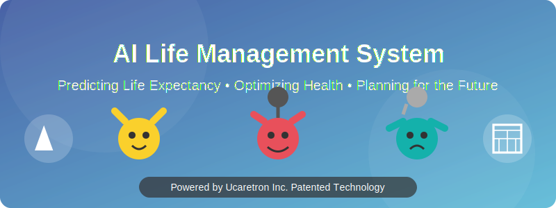
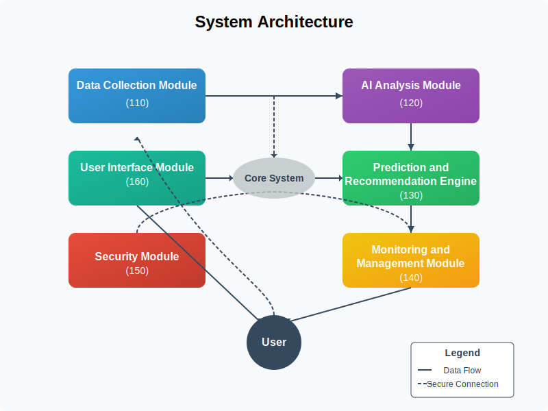
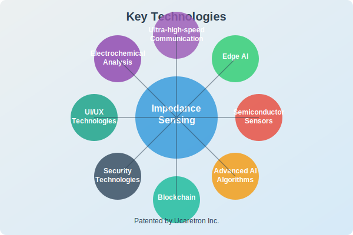
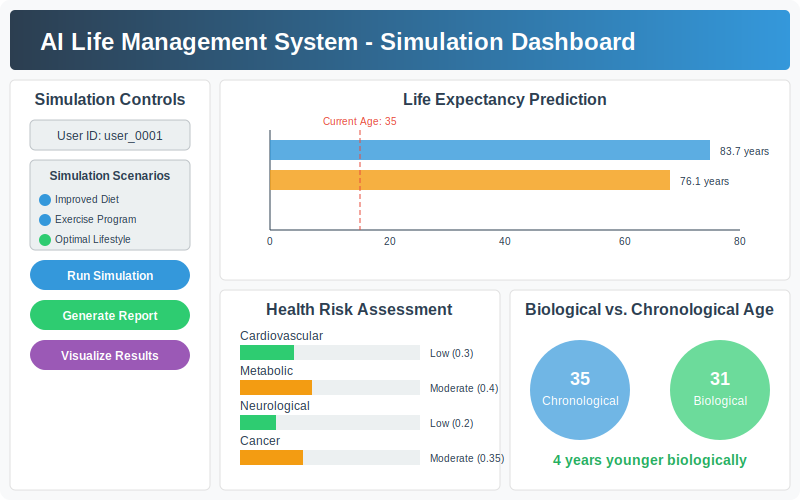
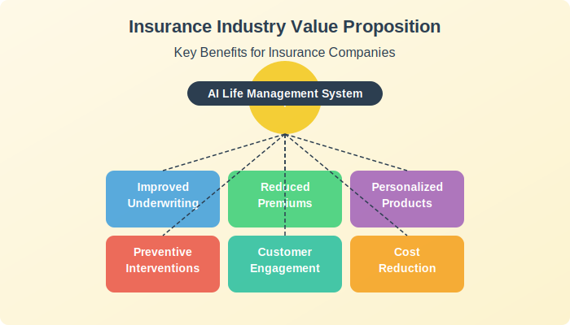
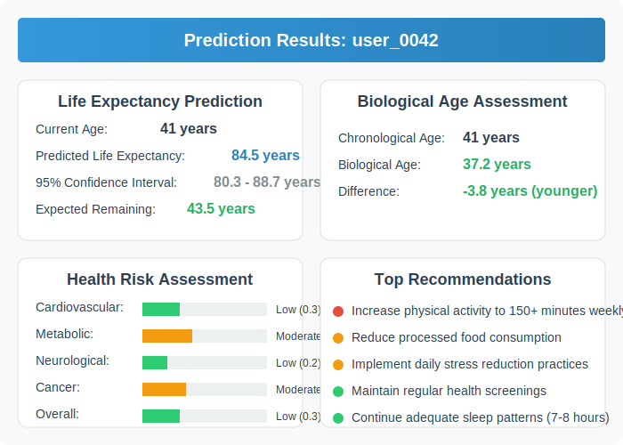

# 🌟 AI-based Life Management and Aging Preparation Decision System 🌟

<div align="center">
  
  
  <h3>Powered by Ucaretron Inc. Patented Technology</h3>
  <p>🚀 Predict Life Expectancy | 💓 Optimize Health | 💰 Plan Finances | 🧠 Live Smarter</p>
</div>

> **Note**: This system is built upon patented technology developed by Ucaretron Inc. The implementation showcases the core concepts and functionalities described in the patent.

## 📋 Overview

The AI-based Life Management System is a cutting-edge solution that uses advanced AI to predict individual life expectancy and provide personalized recommendations for health optimization, aging preparation, and quality of life improvements.

<div align="center">
  
</div>

## 🏗️ System Architecture

The system consists of six integrated modules working together to deliver a comprehensive life management solution:

<div align="center">
  
</div>

### 🔹 Data Collection Module (110)
- Collects various types of user data including health metrics, lifestyle information, and environmental factors
- Interfaces with wearable sensors, medical devices, and smart home systems
- Uses patented ear-insert sensors with frequency scanning impedance technology
- Securely stores data in a privacy-compliant database system
- Implements real-time data validation and preprocessing

### 🔹 AI Analysis Module (120)
- Processes collected data using deep learning and machine learning algorithms
- Identifies patterns and trends in users' health and lifestyle data
- Employs federated learning techniques for enhanced privacy protection
- Utilizes natural language processing for medical record analysis
- Calculates biological age based on advanced biomarkers

### 🔹 Prediction and Recommendation Engine (130)
- Generates personalized health forecasts and life expectancy predictions
- Provides tailored recommendations for lifestyle improvements
- Develops aging preparation strategies based on multiple scenarios
- Creates financial and healthcare planning roadmaps
- Uses reinforcement learning to optimize recommendations

### 🔹 Monitoring and Management Module (140)
- Tracks user adherence to recommendations and health plans
- Analyzes system performance and prediction accuracy
- Provides automated alerts for critical health indicators
- Generates periodic progress reports and insights
- Adjusts strategies based on real-time feedback

### 🔹 Security Module (150)
- Implements multi-layered data encryption and access control
- Ensures compliance with international privacy regulations
- Utilizes blockchain technology for secure medical record integration
- Conducts regular security audits and vulnerability assessments
- Maintains data anonymization for analytics

### 🔹 User Interface Module (160)
- Delivers intuitive mobile and web application interfaces
- Supports voice-controlled AI assistants for hands-free interaction
- Integrates AR/VR visualization tools for health data representation
- Provides accessibility features for users of all abilities
- Presents complex health data in understandable visualizations

## 🔬 Key Technologies

<div align="center">
  
</div>

- **Ultra-high-speed communication**: Enables seamless data transfer between system components and external healthcare systems
- **Edge AI**: Processes sensitive data locally on devices to enhance privacy and reduce latency
- **Ultra-high-density semiconductor sensor technology**: Provides precise health monitoring with minimal invasiveness
- **Electrochemical impedance measurement**: Delivers comprehensive biomarker analysis without invasive procedures
- **Advanced AI algorithms**: Utilizes cutting-edge deep learning, reinforcement learning, and natural language processing techniques
- **Blockchain technology**: Secures medical records and ensures data integrity throughout the system
- **Security technologies**: Implements state-of-the-art encryption, access control, and differential privacy measures
- **User interface technologies**: Creates engaging and accessible interaction through mobile, web, AR/VR, and voice interfaces

## 🧪 Testing and Validation

To ensure the system functions reliably, accurately, and securely, we've established comprehensive testing and validation protocols:

<div align="center">
  
</div>

- **Module-Level Testing**: Rigorous validation of each core component:
  - Data Collection accuracy and reliability
  - AI model performance and prediction validity
  - Recommendation engine effectiveness
  - Monitoring system responsiveness
  - Security vulnerability assessment
  - User interface accessibility and usability

- **System Integration Testing**: End-to-end validation of complete system workflows
- **Clinical Validation**: Medical expert review and comparison with established guidelines
- **Regulatory Compliance**: Verification of adherence to relevant healthcare and privacy regulations
- **User Acceptance Testing**: Phased testing with controlled user groups under various scenarios

For detailed testing protocols, see [Testing and Validation Protocols](docs/testing_validation_protocols.md)

## 🚀 Getting Started

### Installation

```bash
# Clone the repository
git clone https://github.com/JJshome/ai-life-management-system.git
cd ai-life-management-system

# Create a virtual environment
python -m venv venv
source venv/bin/activate  # On Windows: venv\\Scripts\\activate

# Install dependencies
pip install -r requirements.txt

# Run the simulation
python -m simulation.run_simulation
```

### Quick Start

```python
from simulation.run_simulation import SimulationRunner
from simulation.visualize import ResultsVisualizer

# Run a simulation for a single user
runner = SimulationRunner()
results = runner.run_single_user_simulation()

# Visualize the results
visualizer = ResultsVisualizer()
visualizer.visualize_life_expectancy(results["user_data"]["user_profile"]["user_id"])
```

## 📊 Simulation Environment

The system includes a comprehensive simulation environment that allows you to test its capabilities with synthetic data. The simulation includes:

<div align="center">
  
</div>

- Synthetic user profiles with realistic health parameters
- Simulated wearable device data and ear-insert sensor readings
- Virtual medical history and lifestyle factors
- Interactive dashboard for visualizing predictions and recommendations
- Scenario testing for different intervention strategies

To run the simulation:

```bash
# Run for a single user
python -m simulation.run_simulation

# Run for multiple users
python -m simulation.run_simulation --users 10

# Run a specific scenario
python -m simulation.run_simulation --user-id test_user --scenario improved_diet
```

## 🎯 Use Cases for Insurance Companies

This system offers significant value to life insurance companies:

<div align="center">
  
</div>

- **Improved Underwriting**: More accurate risk assessment through detailed health profiles and predictive models
- **Reduced Premiums**: Better risk assessment allows for more competitive pricing
- **Personalized Products**: Creation of tailored insurance products based on individual health profiles
- **Preventive Interventions**: Early identification of health risks enables proactive interventions
- **Customer Engagement**: Increased customer interaction through the health monitoring platform
- **Data-Driven Insights**: Aggregate anonymized data provides valuable industry insights
- **Cost Reduction**: Lower claim rates through improved health outcomes and early intervention

## 🧪 Example Output

<div align="center">
  
</div>

The system provides comprehensive output including:

- Predicted life expectancy with confidence intervals
- Current biological age compared to chronological age
- Health risk assessment across multiple domains
- Personalized recommendations for lifestyle optimization
- Financial planning guidelines based on predicted lifespan
- Simulated scenarios showing impacts of different interventions

## 🔒 Privacy and Security

The system prioritizes user privacy and data security:

- All personal data is encrypted at rest and in transit
- Local processing of sensitive information using edge computing
- Federated learning techniques that avoid central storage of raw data
- Differential privacy implementation for aggregate analytics
- Compliance with GDPR, HIPAA, and other relevant regulations
- Regular security audits and vulnerability assessments

## 📚 Documentation

Detailed documentation is available in the [docs](./docs) directory:

- [System Architecture](./docs/architecture.md)
- [Impedance Technology](./docs/technologies/impedance_tech.md)
- [Simulation Guide](./simulation/README.md)
- [Testing and Validation Protocols](./docs/testing_validation_protocols.md)

## 🚧 Project Status

**Current Development Phase**: Research and Development
- Core technologies under development
- Initial implementation of key modules in progress
- Testing and validation protocols established
- Not fully tested and debugged yet

## ⚠️ Disclaimer

- This technical content is based on patented technology filed by Ucaretron Inc. The system, developed with Ucaretron Inc.'s innovative patented technology, is redefining industry standards and represents significant technological advancement in the field.
- The data and predictions generated by this system are simulated and for demonstration purposes only.
- This implementation is a technology demonstration and should not be used to make actual health or financial decisions.

## 📄 License

Proprietary - All rights reserved. The underlying technology is protected by patents owned by Ucaretron Inc.
